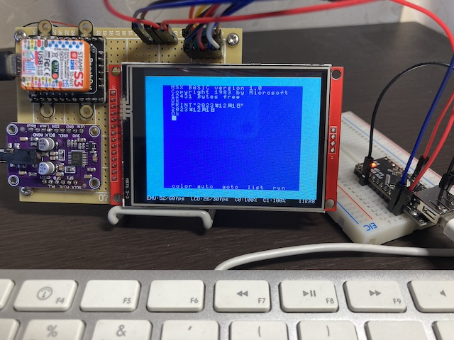

# micro MSX2+ for M5StampS3



- micro-msx2p を M5StampS3 + ILI9341 LCD での動作をサポートしたものです
- M5StampS3 の性能上の都合で MSX2/2+ の再現度の高いエミュレーションは難しいと判断したため MSX1 コアを使っています

## Rquired Hardware

- M5StampS3
- LCD (ILI9341)
  - Display Resolution: 240x320 (QVGA)
  - Touch Feature: Not Required
- DAC (UDA1334A)
- Joypad (GPIO+GND直結)
- Keyboard ([かんたんUSBホスト](https://q61.org/blog/2021/06/09/easyusbhost/))

## References

- 詳しい組み立て方法は [こちらの記事](https://qiita.com/suzukiplan/items/b5882449fdbf571b4e80) を参照してください
- ジョイパッドについては [こちらの記事](https://note.com/suzukiplan/n/ncccafb305eae) を参照してください

## Pin Assign

### LCD + M5StampS3

|LCD (ILI9341)|M5StampS3|用途|
|:-:|:-:|:-|
|`VCC`|`3V3`|電源給電|
|`GND`|`GND`|グランド|
|`CS`|`1` (GPIO)|LCD チップ選択有効化の信号|
|`RESET`|`EN`|リセット信号|
|`DC`|`3` (GPIO)|データ/レジスタ選択の信号|
|`SDI (MOSI)`|`13 SDA`|I2C (Stamp→LCD方向のデータ送信)|
|`SCK`|`15 SCL`|I2C (クロック同期)|
|`LED`|`3V3`|バックライト|
|`SDO (MISO)`|配線なし|LCD→Stamp方向のデータ送信は不要なため|
|`T_CS`|配線なし|タッチ機能は利用しないため|
|`T_DIN`|配線なし|タッチ機能は利用しないため|
|`T_DO`|配線なし|タッチ機能は利用しないため|
|`T_IRQ`|配線なし|タッチ機能は利用しないため|

### DAC + M5StampS3

|DAC (UDA1334A)|M5StampS3|用途|
|:-:|:-:|:-|
|`VIN`|`5V`|電源給電|
|`GND`|`GND`|グランド|
|`WSEL`|`9`|I2S (チャネルセレクタ)|
|`DIN`|`7`|I2S (データ送信)|
|`BCLK`|`5`|I2S (クロック同期)|

### Joypad + M5StampS3

|Joypad|M5StampS3|用途|
|:-:|:-:|:-|
|`GND`|`GND`|グランド (※各ボタンのGNDを全て同じGNDに接続)|
|Start|`10`|スタートボタン (特殊キー割り当て)|
|Select|`11`|セレクトボタン (特殊キー割り当て)|
|A|`12`|Aボタン (トリガー1)|
|B|`14`|Bボタン (トリガー2)|
|Left|`39`|左キー|
|Right|`40`|右キー|
|Up|`41`|上キー|
|Down|`42`|下キー|

### Keyboard + M5StampS3

- キーボードは ([かんたんUSBホスト](https://q61.org/blog/2021/06/09/easyusbhost/)) 経由で USB キーボードを接続してご利用ください
- 現状 Mac 用のキー割当になっています
- 最後に受信したイベント（AABCC形式）を画面右下にプレビュー表示されるので、Mac 用の USB キーボード以外を利用したい場合、[app.cpp](src/app.cpp) の `KantanUsbKeyboard::init` メソッドのキーマップ（mapK, mapM）初期化処理を使いたいキーボードに合わせて適宜修正して利用する想定です

|Easy USB Host|M5StampS3|用途|
|:-|:-|:-|
|`GND`|`GND`|グランド|
|`5V`|`5V`|かんたん USB ホストの電源|
|`VBUS`|`5V`|USB キーボードの電源|
|`TX1`|`44 (U0RX)`|UART通信（Serial）|
|`P3.3 - Mode` → `GND`|-|イベントモードに設定|

## Build

### Support OS

- macOS
- Linux

> ビルド以外にも色々な事前処理を行っており（詳細は [Makefile](Makefile) を参照）、その関係で基本的に **macOS または Linux 系 OS でのコマンドラインビルドのみサポート** します。Windows で試したい場合は WSL2 等をご利用ください。

### Middleware

- [PlatformIO Core (CLI)](https://docs.platformio.org/en/latest/core/index.html)
  - macOS: `brew install platformio`
- CLANG C++
- GNU Make

> Playform I/O は Visual Studio Code 経由で用いる方式が一般的には多いですが、本プロジェクトでは CLI (pioコマンド) のみ用いるので Visual Studio Code や Plugin のインストールは不要です。

### How to Build

```
make
```

上記コマンドを実行すると次の手続きを実行します:

1. MSX1 エミュレータコアモジュール [src1](../src1) を [include](include) に展開
2. [bios](bios) 以下の ROM ファイルから [src](src) 以下に `rom_xxx.c` を自動生成
3. `src/rom_xxx.c` から [include](include) 以下に `roms.hpp` を自動生成
4. `pio run -t upload` で M5Stack 向けのビルドとアップロード（ファームウェア書き込み）

### Build only

```
make build
```

> ステップ 4 の手続きが `pio run -t upload` → `pio run` に変わります。

## Replace ROM file

1. [bios/game.rom](bios/game.rom) を更新
2. `src/rom_game.c` を削除
3. メガロムの場合 [src/app.cpp](src/app.cpp) の `setup` 関数で実行している `MSX1::loadRom` の `MSX1_ROM_TYPE_` を対象のメガロム種別に変更

## License

本プログラムのライセンスは [MIT](LICENSE.txt) とします。

また、本プログラムには以下のソフトウェアに依存しているため、再配布時にはそれぞれのライセンス条項の遵守をお願いいたします。

- LovyanGFX
    - Web Site: [https://github.com/lovyan03/LovyanGFX](https://github.com/lovyan03/LovyanGFX)
    - License: [FreeBSD](../licenses-copy/LovyanGFX.txt)
    - `Copyright (c) 2012 Adafruit Industries.  All rights reserved.`
    - `Copyright (c) 2020 Bodmer (https://github.com/Bodmer)`
    - `Copyright (c) 2020 lovyan03 (https://github.com/lovyan03)`
- TJpgDec
    - Web Site: [http://elm-chan.org/fsw/tjpgd/00index.html](http://elm-chan.org/fsw/tjpgd/00index.html)
    - License: [original](../licenses-copy/TJpgDec.txt)
    - `(C)ChaN, 2019`
- Pngle
    - Web Site: [https://github.com/kikuchan/pngle](https://github.com/kikuchan/pngle)
    - License: [MIT](../licenses-copy/Pngle.txt)
    - `Copyright (c) 2019 kikuchan`
- QRCode
    - Web Site: [https://github.com/ricmoo/QRCode](https://github.com/ricmoo/QRCode)
    - License: [MIT](../licenses-copy/QRCode.txt)
    - `Copyright (c) 2017 Richard Moore     (https://github.com/ricmoo/QRCode)`
    - `Copyright (c) 2017 Project Nayuki    (https://www.nayuki.io/page/qr-code-generator-library)`
- result
    - Web Site: [https://github.com/bitwizeshift/result](https://github.com/bitwizeshift/result)
    - License: [MIT](../licenses-copy/result.txt)
    - `Copyright (c) 2017-2021 Matthew Rodusek`
- GFX font and GLCD font
    - Web Site: [https://github.com/adafruit/Adafruit-GFX-Library](https://github.com/adafruit/Adafruit-GFX-Library)
    - License: [2-clause BSD](../licenses-copy/Adafruit-GFX-Library.txt)
    - `Copyright (c) 2012 Adafruit Industries.  All rights reserved.`
- Font 2,4,6,7,8
    - Web Site: [https://github.com/Bodmer/TFT_eSPI](https://github.com/Bodmer/TFT_eSPI)
    - License: [FreeBSD](../licenses-copy/TFT_eSPI.txt)
    - `Copyright (c) 2012 Adafruit Industries.  All rights reserved.`
    - `Copyright (c) 2023 Bodmer (https://github.com/Bodmer)`
- converted IPA font
    - Web Site: [https://www.ipa.go.jp/index.html](https://www.ipa.go.jp/index.html)
    - License: [IPA Font License Agreement v1.0](../licenses-copy/IPA_Font_License_Agreement_v1.0.txt)
- efont
    - Web Site: [http://openlab.ring.gr.jp/efont/](http://openlab.ring.gr.jp/efont/)
    - License: [3-clause BSD](../licenses-copy/efont.txt)
    - `(c) Copyright 2000-2001 /efont/ The Electronic Font Open Laboratory. All rights reserved.`
- TomThumb font
    - Web Site:
    - License: [3-clause BSD](../licenses-copy/TomThumb.txt)
    - `Copyright 1999 Brian J. Swetland`
    - `Copyright 1999 Vassilii Khachaturov`
    - `Portions (of vt100.c/vt100.h) copyright Dan Marks`
- SUZUKI PLAN - Z80 Emulator
  - Web Site: [https://github.com/suzukiplan/z80](https://github.com/suzukiplan/z80)
  - License: [MIT](../licenses-copy/z80.txt)
  - `Copyright (c) 2019 Yoji Suzuki.`
- micro MSX2+
  - Web Site: [https://github.com/suzukiplan/micro-msx2p](https://github.com/suzukiplan/micro-msx2p)
  - License: [MIT](../LICENSE.txt)
  - `Copyright (c) 2023 Yoji Suzuki.`
