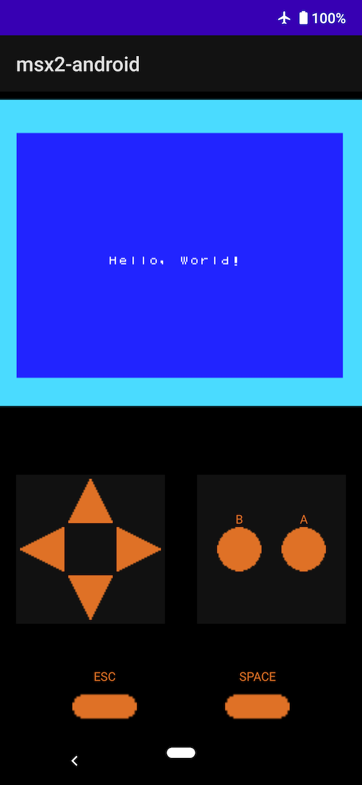

# micro MSX2+ - example implementation for Android



## About

- Android 版の micro MSX2+ 実装例です
- macOS 版とは異なりシンプルな機能のみ提供しています
  - 固定ゲームの起動のみサポート
  - バーチャルパッドによる入力

## How to Use

Android Studio でビルドすれば [asset](app/src/main/assets) に組み込まれた game.rom が起動します

## Configuration

### game.rom

- デフォルトでは Hello, World! を表示するシンプルな ROM ファイルが組み込まれています
- [app/src/main/assets/game.rom](app/src/main/assets/game.rom) を置き換えてビルドすることで任意のゲームを起動できます

### How to launch MegaRom

メガロムを起動する場合 [app/src/main/cpp/jni.cpp](app/src/main/cpp/jni.cpp) の `loadRom` をしている箇所の `MSX2_ROM_TYPE` を書き換えてください。

```c++
msx2->loadRom(rom.data, (int) rom.size, MSX2_ROM_TYPE_NORMAL);
```

## License

本ディレクトリ配下のソースコードやアセット類は micro MSX2+ の本体ライセンスと等価とします。
