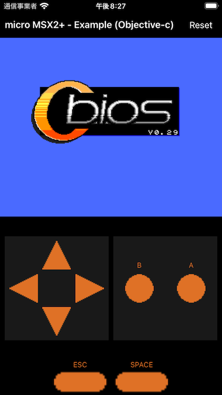

# micro MSX2+ for iOS

## About

- micro-msx2p の機能を利用できる [Framework](MSX2) を提供しています
- [Framework](MSX2) を利用した [Swift の Example](app-swift) を提供しています
- [Framework](MSX2) を利用した [Objective-c の Example](app-objc) を提供しています
- [Framework](MSX2) を利用した Swift-UI の Example を提供しようと思っていた時期もありました

> Swift-UI は正直な所その学習コストに見合うメリットが微妙というか、「これなら Flutter を使った方が良いよね」と思っている節があります。

## Basic Usage

### Pods (WIP)

Podfile に 次の行を追加してください。

```Podfile
pod 'MSX2', :podspec => 'https://raw.githubusercontent.com/suzukiplan/micro-msx2p/master/msx2-ios/MSX2.podspec'
```

_例: `MyApp` というアプリの場合_

```Podfile
target 'MyApp' do
  use_frameworks!
  pod 'MSX2', :podspec => 'https://raw.githubusercontent.com/suzukiplan/micro-msx2p/master/msx2-ios/MSX2.podspec'
end
```

### 基本的な使い方 (Swift)

#### 1. Import

```swift
import MSX2
```

#### 2. Initialize

`MSX2View` は初期化処理が完了するまでブラックスクリーンの状態でサスペンド状態になり、`setupWithCBiosMain` メソッドでC-BIOSイメージやゲームのROMイメージの読み込みが完了することで実行状態に遷移します。

初期化処理は、ファイルI/Oなどの時間が掛かる処理の実行が必要なため、`DispatchQueue.global(qos: .default).async` を用いてサブスレッドで非同期に実行することが望ましいです。

以下、サブスレッドを用いた初期化処理を `ViewController` の `viewDidLoad` で実装する例を示します。

```swift
DispatchQueue.global(qos: .default).async {
    let main = NSData(contentsOfFile: Bundle.main.path(forResource: "cbios_main_msx2+_jp", ofType: "rom")!)!
    let logo = NSData(contentsOfFile: Bundle.main.path(forResource: "cbios_logo_msx2+", ofType: "rom")!)!
    let sub = NSData(contentsOfFile: Bundle.main.path(forResource: "cbios_sub", ofType: "rom")!)!
    let rom = NSData(contentsOfFile: Bundle.main.path(forResource: "game", ofType: "rom")!)!
    self.msx2View.setup(withCBiosMain: main as Data,
                        logo: logo as Data,
                        sub: sub as Data,
                        rom: rom as Data,
                        romType: .normal,
                        select: 0x1B,
                        start: 0x20)
}
```

#### 3. Set Delegate

`MSX2View` を扱う `ViewController` などで `MSX2ViewDelegate` の実装を行います。

```swift
class ViewController: UIViewController, MSX2ViewDelegate {
```

```swift
func didRequirePad1Code(with view: MSX2View) -> Int {
    virtualPadView.joyPad.code
}

func didStart(with view: MSX2View) {
}

func didStop(with view: MSX2View) {
}
```

- `didRequirePad1Code` ジョイパッドの入力コードを返します（毎フレームコールバックされます）
- `didStart` エミュレータが開始する直前にコールバックされます
- `didStop` エミュレータが停止する直前にコールバックされます

### 基本的な使い方 (Objective-c)

#### 1. Impoort

```objective-c
@import MSX2;
```

フレームワーク MSX2 を import することで、主に以下のクラスを用いて micro-msx2p を用いたアプリを実装できます。

- `MSX2Core` micro-msx2p コアモジュールの Objective-c ラッパー（上級者向け）
- `MSX2View` micro-msx2p が iOS で簡単に扱える `UIView` 派生の View

以下、`MSX2View` の扱い方について解説します。

#### 2. Initialize

`MSX2View` は初期化処理が完了するまでブラックスクリーンの状態でサスペンド状態になり、`setupWithCBiosMain` メソッドでC-BIOSイメージやゲームのROMイメージの読み込みが完了することで実行状態に遷移します。

初期化処理は、ファイルI/Oなどの時間が掛かる処理の実行が必要なため、`dispatch_async` を用いてサブスレッドで非同期に実行することが望ましいです。

以下、サブスレッドを用いた初期化処理を `ViewController` の `viewDidLoad` で実装する例を示します。

```objective-c
__weak ViewController* weakSelf = self;
dispatch_async(dispatch_get_global_queue(DISPATCH_QUEUE_PRIORITY_DEFAULT, 0), ^{
    NSData* main = [NSData dataWithContentsOfFile:[[NSBundle mainBundle] pathForResource:@"cbios_main_msx2+_jp" ofType:@"rom"]];
    NSData* logo = [NSData dataWithContentsOfFile:[[NSBundle mainBundle] pathForResource:@"cbios_logo_msx2+" ofType:@"rom"]];
    NSData* sub = [NSData dataWithContentsOfFile:[[NSBundle mainBundle] pathForResource:@"cbios_sub" ofType:@"rom"]];
    NSData* rom = [NSData dataWithContentsOfFile:[[NSBundle mainBundle] pathForResource:@"game" ofType:@"rom"]];
    [weakSelf.msx2View setupWithCBiosMain:main
                                        logo:logo
                                        sub:sub
                                        rom:rom
                                    romType:MSX2RomTypeNormal
                                    select:0x1B
                                    start:0x20];
});
```

#### 3. Set Delegate

`MSX2View` を扱う `ViewController` などで `MSX2ViewDelegate` の実装を行います。

```objective-c
@interface ViewController () <MSX2ViewDelegate>
```

```objective-c
- (NSInteger)didRequirePad1CodeWithView:(MSX2View*)view
{
    return 0;
}

- (void)didStartWithView:(MSX2View*)view
{
    NSLog(@"Emulator start");
}

- (void)didStopWithView:(MSX2View*)view
{
    NSLog(@"Emulator stop");
}
```

- `didRequirePad1CodeWithView` ジョイパッドの入力コードを返します（毎フレームコールバックされます）
- `didStartWithView` エミュレータが開始する直前にコールバックされます
- `didStopWithView` エミュレータが停止する直前にコールバックされます

### Example

[app-swift](app-swift) ディレクトリと [app-objc](app-objc) ディレクトリ以下が `MSX2View` を用いたアプリケーション実装の例です。



- [ViewController.swift](app-swift/ViewController.swift) または [ViewController.m](app-objc/ViewController.m) の実装を見れば `MSX2View` の使い方を簡単に把握できるようになっています
- XCODE でビルドすれば [roms](app-swift/roms) に組み込まれた game.rom が起動します
- デフォルトの game.rom は `Hello, World!` を表示するシンプルな ROM ファイルです
- game.rom を置き換えることで任意のゲームを起動できます
- メガロムを起動する時は初期化時に指定している `romType` を適切に変更してください

## Advanced Usage

`MSX2View` を用いることで、iOSで簡単に micro-msx2p を用いることができますが、コアモジュールの機能をそのまま利用できる [`MSX2Core`](MSX2/MSX2Core.h) を用いることで、micro-msx2p の全ての機能を活用した高度なプログラムを開発することもできます。

## License

本プログラムには次の OSS が含まれています。利用に当たっては、著作権（財産権）及び著作者人格権は各作者に帰属する点の理解と、ライセンス条項の厳守をお願いいたします。

- LZ4 Library
  - Web Site: [https://github.com/lz4/lz4](https://github.com/lz4/lz4) - [lib](https://github.com/lz4/lz4/tree/dev/lib)
  - License: [2-Clause BSD](../licenses-copy/lz4-library.txt)
  - `Copyright (c) 2011-2020, Yann Collet`
- C-BIOS
  - Web Site: [https://cbios.sourceforge.net/](https://cbios.sourceforge.net/)
  - License: [2-Clause BSD](../licenses-copy/cbios.txt)
  - `Copyright (c) 2002-2005 BouKiCHi.  All rights reserved.`
  - `Copyright (c) 2003 Reikan.  All rights reserved.`
  - `Copyright (c) 2004-2006,2008-2010 Maarten ter Huurne.  All rights reserved.`
  - `Copyright (c) 2004-2006,2008-2011 Albert Beevendorp.  All rights reserved.`
  - `Copyright (c) 2004-2005 Patrick van Arkel.  All rights reserved.`
  - `Copyright (c) 2004,2010-2011 Manuel Bilderbeek.  All rights reserved.`
  - `Copyright (c) 2004-2006 Joost Yervante Damad.  All rights reserved.`
  - `Copyright (c) 2004-2006 Jussi Pitkänen.  All rights reserved.`
  - `Copyright (c) 2004-2007 Eric Boon.  All rights reserved.`
- emu2413
  - Web Site: [https://github.com/digital-sound-antiques/emu2413](https://github.com/digital-sound-antiques/emu2413)
  - License: [MIT](../licenses-copy/emu2413.txt)
  - `Copyright (c) 2001-2019 Mitsutaka Okazaki`
- SUZUKI PLAN - Z80 Emulator
  - Web Site: [https://github.com/suzukiplan/z80](https://github.com/suzukiplan/z80)
  - License: [MIT](../licenses-copy/z80.txt)
  - `Copyright (c) 2019 Yoji Suzuki.`
- micro MSX2+
  - Web Site: [https://github.com/suzukiplan/micro-msx2p](https://github.com/suzukiplan/micro-msx2p)
  - License: [MIT](../LICENSE.txt)
  - `Copyright (c) 2023 Yoji Suzuki.`

> [app-objc](./app-objc)ディレクトリ配下と[MSX2](./MSX2)ディレクトリ配下のソースコードは全て micro MSX2+ の一部として同じライセンス下で利用可能です。
