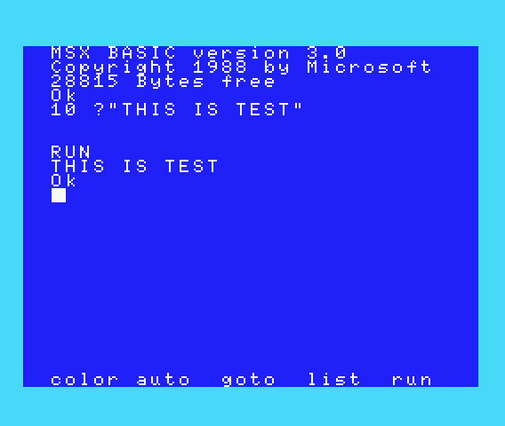

# MSX-BASIC Runner for CLI

- コマンドラインで MSX-BASIC の実行結果を確認できるツールです
- 本プログラムを動作させるには MSX2+ の BIOS ファイルが必要です
- CLANG と GNU MAKE が動く OS なら問題なく動作する筈です

## Pre-requests

- CLANG C++
- GNU MAKE

## Setup BIOS files

カレントディレクトリに実機から吸い出した以下の BIOS ファイルを配置してください。

- `MSX2P.ROM` メイン BIOS
- `MSX2PEXT.ROM` サブ BIOS

> 吸い出した機種によってはこの手順では正常に動作しないことがあります。その場合、[こちら](https://github.com/suzukiplan/micro-msx2p#2-2-setup-slot) を参考にして必要な BIOS ファイルの追加と `setup` の修正をすることで動作する場合があります。（起動時に BASIC が起動せずに初期ユーティリティが動作する機種の場合、BASIC を起動するように操作処理を追加する必要があることもあります）

## How to Build

```bash
make
```

## How to Execute

```
./runbas /path/to/file.bas [frames]
```

- `/path/to/file.bas` ... 実行する BASIC ファイル（※テキスト形式）
- `frames` ... 実行フレーム数（省略時は `600` ≒ 10秒 を仮定）

実行が成功するとカレントディレクトリに次のファイルが生成されます。

- `runbas.sav` ... BASIC が起動完了時点のクイックセーブデータ
- `result.bmp` ... 指定した BASIC コード実行後の画面スクショ

なお、カレントパスに `runbas.sav` が存在する環境では実行時間が（BASIC起動処理にかかる時間分）短縮されます。

## Example

以下のファイル（test.bas）を実行する例を示します。

```test.bas
10 ?"THIS IS TEST"
```

```text
% make
clang++ -Os -std=c++11 -I../../msx2-osx/lz4 -o runbas runbas.cpp emu2413.o lz4.o
suzukiplan@YojinoMacBook-Air runbas % rm *.sav
suzukiplan@YojinoMacBook-Air runbas % ./runbas hello.bas
Setup SLOT 3-0 $0000~$FFFF = RAM
Setup SLOT 0-0 $0000~$7FFF = MAIN
Setup SLOT 3-1 $0000~$3FFF = SUB
Waiting for launch MSX-BASIC...
Typing hello.bas...
---------- START ----------
RUN' 
THIS IS TEST
Ok
----------- END -----------
Writing result.bmp...
%
```

|result.bmp|
|:-|
||
